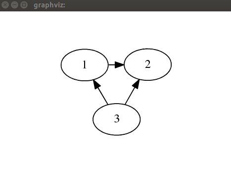

Examples
========

To help you to get started with Graphs.jl, here is a simple example::

    julia> using Graphs

    julia> g = simple_graph(3)
    Directed Graph (3 vertices, 0 edges)

    julia> add_edge!(g, 1, 2)
    edge [1]: 1 -- 2

    julia> add_edge!(g, 3, 2)
    edge [2]: 3 -- 2

    julia> add_edge!(g, 3, 1)
    edge [3]: 3 -- 1

    julia> plot(g)

We can also generate simple graphs with graph generators. For example::

     julia> g2 = simple_cubical_graph()
     Undirected Graph (8 vertices, 12 edges)

and check the number of vertices and edges with::

     julia> num_vertices(g2)
     8

     julia> num_edges(g2)
     12

We can use an adjacency matrix to represent ``g2``::

     julia> adjacency_matrix(g2)
     8x8 Array{Bool,2}:
     false   true  false   true   true  false  false  false
     true  false   true  false  false  false  false   true
     false   true  false   true  false  false   true  false
     true  false   true  false  false   true  false  false
     true  false  false  false  false   true  false   true
     false  false  false   true   true  false   true  false
     false  false   true  false  false   true  false   true
     false   true  false  false   true  false   true  false

